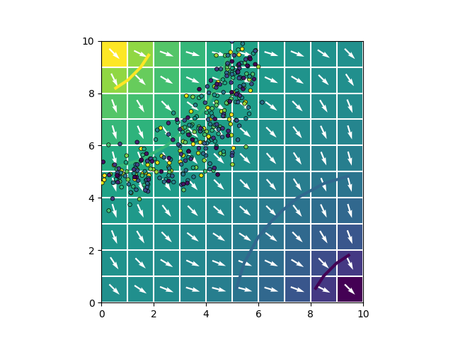

## flopyrw
An extension of [FloPy](https://github.com/modflowpy/flopy) to write input simulation files for [MODPATH-RW](https://github.com/upc-ghs/modpath-rw) with Python.

### Overview
Provides classes extended from the `modpath` module in `flopy` adapted to specific structures required by MODPATH-RW. Also introduces new package writers required by the program, consistent with the [Documentation of Input-Output](https://github.com/upc-ghs/modpath-rw/blob/develop/doc/modpath-rw_IO_v100_.pdf). 


### Quickstart
**Install**

To install the package from source, clone the repository:

```
git clone https://github.com/upc-ghs/flopyrw
```
and install 

```
pip install -e /the/path/to/flopyrw/
```

You can also install the current release from [PyPI](https://pypi.org/project/flopyrw/):

```
pip install flopyrw
```

**Use it**

Classes follow the same logic than `flopy`, configuring packages on top of a MODFLOW flow-model object. For example, the `flopy` quickstart case: 

```py
import os
import flopy
from flopyrw import modpathrw

ws   = './mymodel'
name = 'mymodel'
sim  = flopy.mf6.MFSimulation(sim_name=name, sim_ws=ws, exe_name='mf6')
tdis = flopy.mf6.ModflowTdis(sim)
ims  = flopy.mf6.ModflowIms(sim)
gwf  = flopy.mf6.ModflowGwf(sim, modelname=name, save_flows=True)
dis  = flopy.mf6.ModflowGwfdis(gwf, nrow=10, ncol=10)
ic   = flopy.mf6.ModflowGwfic(gwf)
npf  = flopy.mf6.ModflowGwfnpf(gwf, save_specific_discharge=True)
# Same than in flopy quickstart,
# but with an aux var for concentration.
chd  = flopy.mf6.ModflowGwfchd(
        gwf,
        auxiliary=['CONCENTRATION'],
        stress_period_data=[
            [(0, 0, 0), 1.,1.],
            [(0, 9, 9), 0.,0.]
        ]
    )
budget_file = name + '.bud'
head_file   = name + '.hds'
oc = flopy.mf6.ModflowGwfoc(gwf,
        budget_filerecord=budget_file,
        head_filerecord=head_file,
        saverecord=[('HEAD', 'ALL'), ('BUDGET', 'ALL')]
    )
sim.write_simulation()
sim.run_simulation()

# Create a modpathrw model
# By default executable is 'mpathrw'
mprw = modpathrw.ModpathRW(flowmodel=gwf)

# Random walk options
modpathrw.ModpathRWOpts(
        mprw,
        timestep = 'min',
        ctdisp   = 0.1,
        courant  = 0.1,
        dimensionsmask=[1,1,0], # Random walk in x,y and not in z
    )

# Dispersion parameters 
modpathrw.ModpathRWDsp( mprw, alphal=0.1, alphat=0.01,  dmeff=0.0 )

# Basic package
modpathrw.ModpathRWBas( mprw, porosity=0.3 )

# Define the solute source
# In forward tracking, only cells with injecting flow-rate release particles
modpathrw.ModpathRWSrc(
        mprw,
        sources=(
            'CHD', # package name
            [            
                [
                    'CONCENTRATION', # aux variable
                    0.001,           # particlesmass
                    (4,4,1)          # template
                ], 
            ],
        ),
    )

# Configure the simulation 
simconfig = {
    'simulationtype'    : 'rwendpoint', 
    'trackingdirection' : 'forward',
    'weaksinkoption'    : 'stop_at',
    'weaksourceoption'  : 'pass_through',
    'stoptimeoption'    : 'specified',
    'stoptime'          : 20.0,
}
mprwsim = modpathrw.ModpathRWSim( mprw,  **simconfig )

# Write the input files
mprw.write_input()

# And run 
mprw.run_model()

# Get output and plot
head   = gwf.output.head().get_data()
bud    = gwf.output.budget()
epoint = flopy.utils.EndpointFile( os.path.join( ws, mprwsim.endpointfilename ) ) 
spdis  = bud.get_data(text='DATA-SPDIS')[0]
qx, qy, qz = flopy.utils.postprocessing.get_specific_discharge(spdis, gwf)
pmv = flopy.plot.PlotMapView(gwf)
pmv.plot_array(head)
pmv.plot_grid(colors='white')
pmv.contour_array(head, levels=[.2, .4, .6, .8], linewidths=3.)
pmv.plot_vector(qx, qy, normalize=True, color="white")
pmv.plot_endpoint( epoint.get_alldata(), zorder=10, s=4, linewidth=0.5, edgecolor='k' )
```


**Note**: In order to run a model via the interface a [MODPATH-RW](https://github.com/upc-ghs/modpath-rw) executable is required. 


### Testing
A suite of [automated tests](autotest/) is available verifying different aspects of the interface and the program. In order to run these tests, some additional dependencies are required, which can be installed with:

```
pip install ".[test]"
```

You can follow the [FloPy test guidelines](https://github.com/modflowpy/flopy/blob/develop/DEVELOPER.md#running-tests) for running and debugging tests. 

Run the complete test suite from the folder ``autotest`` with the command:

```
pytest -s -v 
```

## Resources
* [flopy](https://github.com/modflowpy/flopy)
* [MODPATH-RW](https://github.com/upc-ghs/modpath-rw)
* [MODPATH](https://www.usgs.gov/software/modpath-particle-tracking-model-modflow)
* [modpath-v7](https://github.com/MODFLOW-USGS/modpath-v7)
* [modpath-omp](https://github.com/upc-ghs/modpath-omp)
